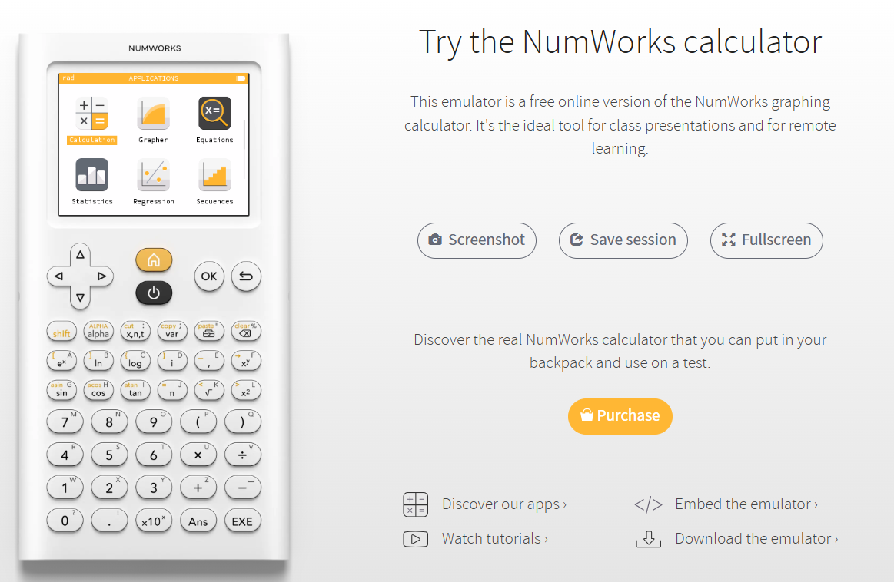
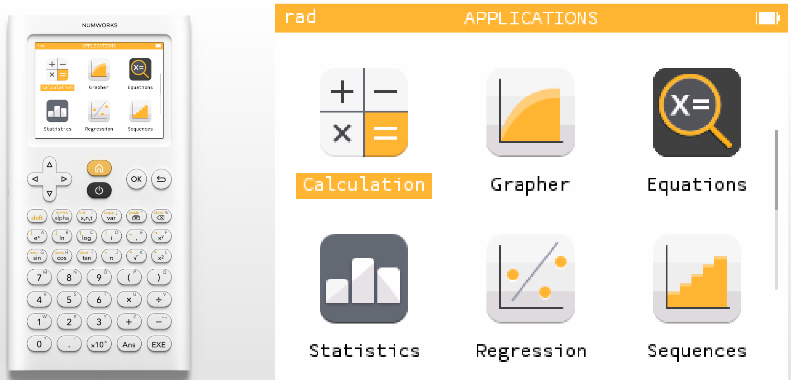
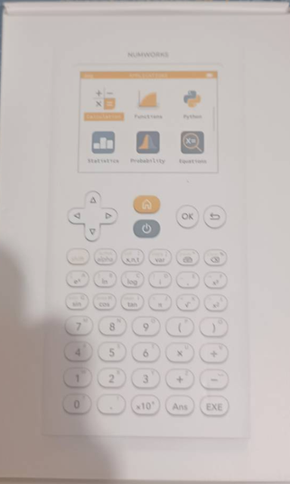
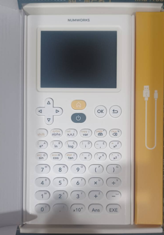
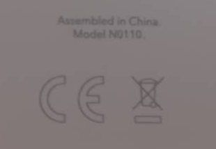

# 認識 Numworks 計算機

NumWorks 這台科學繪圖計算機是一個很有趣的專案。它是在 2017 年左右推出，由一間法國新創公司開發。跟一般卡西歐、德州儀器 (TI) 那些老牌的計算機不同，NumWorks 走的是「開放、現代化」路線。

* 專案歷史

一開始 NumWorks 的目標，就是要打破傳統計算機的封閉設計。他們覺得學校用的手持式計算機都太老舊、介面不好用，而且相關軟體資訊不透明，所以就做了一台「開放原始碼」的科學計算機。這台計算機的軟體、韌體、甚至硬體設計，都放在 GitHub 上，大家都可以去看、甚至修改。

* 專案特色

  - 開放原始碼：系統韌體完全開放，學生或老師可以自己改，甚至可以刷自己的版本。<del>但這後來也造成許多法國高中生利用這台計算機進行作弊的問題。</del>

  - Python 支援：它內建 MicroPython 環境，學生可以直接寫程式，這在同類型計算機裡很少見。

  - 介面現代化：UI 設計乾淨，圖示、功能表都很直覺，不像傳統計算機那麼「工程師風格」。

  - 硬體設計公開：就連電路板、外殼設計圖都公開，算是教育領域很少見的「完全透明」。

  - 社群參與：因為是開源專案，很多開發者、老師、學生會在社群裡一起改進功能。

簡單講，NumWorks 不只是計算機，而是「一個可以被改造、被學習的教育工具」。它的精神很像 Raspberry Pi 或 Arduino 在電腦領域的角色，讓學生不只會用，還能學怎麼做!

# NumWorks 與 CASIO、 TI 計算機比較表

| 特色       | **NumWorks**           | **Casio / TI 等傳統計算機**                    |
| -------- | ---------------------- | ---------------------------------------- |
| **專案性質** | 開源專案，硬體、韌體、軟體全部公開      | 封閉專案，軟體與硬體設計不公開                          |
| **發展時間** | 2017 年推出，算是新創公司作品      | 歷史悠久，Casio 1970s、TI 更早                   |
| **軟體更新** | 可自己下載韌體更新，甚至改源碼        | 官方固定更新，使用者無法自行改                          |
| **程式語言** | 內建 **Python** 解譯器      | Casio、TI 大多使用自家 BASIC 或專屬語法              |
| **操作介面** | 現代化 UI，圖形化圖示，直覺式操作     | 偏傳統，按鍵功能多，需熟悉按法                          |
| **學習導向** | 不只學數學，也能學 Python 與程式設計 | 著重數學運算與考試需求                              |
| **社群參與** | 開發者、學生可參與 GitHub 專案改進  | 社群主要是使用者討論，無法直接改進核心                      |
| **硬體設計** | 電路板、外殼設計圖全公開           | 硬體規格與設計完全封閉                              |
| **適用場景** | 教學、研究、STEM 教育、Maker    | 考試標準用機、專業工程應用                            |
| **價格區間** | 約 100 美元上下             | Casio 入門款便宜 (20–50 美元)，TI 高階款可達 150 美元以上 |

# 模擬器與 App 下載

NumWorks 公司提供網頁線上模擬器，讓數學老師可以在教學現場使用，也可以下載模擬器離線使用，也能透過加入程式碼，將計算機內嵌至你的網站上(但請注意版權宣告)。

如果你選擇使用全螢幕(Fullscreen)功能，你會發現此功能非常適合課堂教學使用。

左邊是教師操作按鍵的畫面，右邊是不同軟體的選單。教師可以隨時搭配左側的截圖功能，將重要步驟與計算結果截圖，作為備課資料使用。

# 開箱介紹

手邊的 Numworks 計算機是託朋友從美國帶回來的。美國的學生其實也不常用這台計算機，不過在美國亞馬遜購買，可免運費寄到美國各州。外包裝就是很清爽素雅的白盒子。

盒子裡面也是維持一樣的簡單風格，就是一台主機、一條傳輸線、一張使用安全注意事項與一張 **NUMWORKS** 字樣的貼紙。

由於我這台機器型號是 **N0110**，屬於早期的版本，韌體可以燒錄客製化的版本。往後的文章有機會再向各位讀者，介紹第三方韌體與軟體資訊。

我們明天再繼續認識 NUMWORKS 計算機的基礎操作按鍵與使用介面。