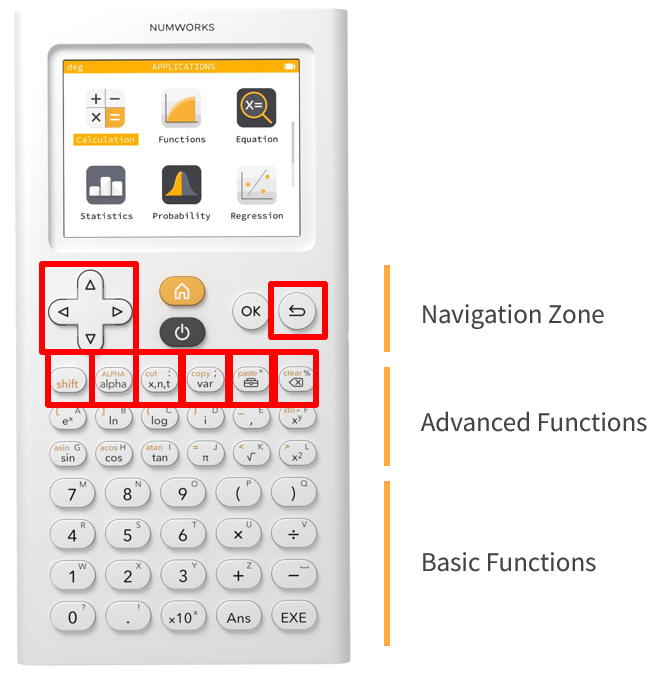
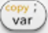

# 鍵盤配置介紹

螢幕主要是顯示應用軟體，而下方的操作鍵盤則分為底下的三個主要區域:

1. 導航區
   - 方向鍵
   - 家目錄鍵
   - 電源鍵
   - OK鍵
   - 返回鍵
2. 進階函數區
   - shift 鍵(傳統繪圖計算機要輸入文字符號所需的按鍵功能)
   - alpha 鍵(輸入特殊符號)
   - x,n,t 鍵
   - var 鍵(建立、查看變數)
   - 工具箱鍵(呼叫進階函數)
   - clear鍵(清除頁面)
3. 基本功能區
   - 0~9 數字鍵
   - 加減乘除
   - 括弧、點號、10^x、Ans、EXE

# 操作介面導覽

* 主選單像智慧型手機(雖然機器沒有觸控功能)

> 打開電源後，畫面不是傳統那種黑底白字的指令模式，而是像手機一樣的「圖示選單」。

> 每個主要功能（計算、函數、統計、機率分佈、序列、Python、設定…）都有一個小圖示，學生可以直接用方向鍵移動，然後按 OK 進入。

這樣的設計讓新手一看就懂，不用死背「要按哪顆鍵才會進到某功能」。

* 操作邏輯直覺化

> 介面裡的文字、圖示都很清楚，例如：輸入數學函數的時候，會有完整的數學排版（像分數就真的是分數表示法，而不是 a/b）。

> 顯示方式比較接近「數學課本」，不像傳統計算機那樣一串符號，對學生來說更直觀。

* Python 編程介面

> 內建一個簡單的文字編輯器，可以直接輸入 Python 程式。

> 有基本的縮排、語法高亮，雖然沒有到電腦 IDE 那麼強，但已經足夠教學生寫小程式（像計算平方數列、畫圖）。

這也是 NumWorks 最大的特色之一，把「計算機」變成「小型編程學習工具」。

* 設定簡單化

> 在設定選單裡，可以調整語言、角度單位（度或弧度）、小數顯示方式等等。

整個選單結構不複雜，學生不用東找西找。

* 圖形顯示

> 在函數、統計這些功能裡，可以直接畫出圖表或曲線。

操作方式是用方向鍵移動畫面或游標，就像在簡單版的 Desmos 上操作一樣，在互動使用上比傳統機種更自然。

# 軟體簡介

1. 計算 Calculation 

> 執行各種計算，包含複數、矩陣、三角函數、排列組合、導數、積分和單位轉換。

2. 繪圖器 Grapher 

> 繪製函數、曲線、圓錐曲線和不等式的圖表，查看點坐標，找到關鍵特徵，並查閱數值表。

3. 方程式 Equations 

> 使用精確解和數值解求解方程式和方程組。

4. 統計 Statistics 

> 研究數據集並查看與您的數據集相關的統計值：平均值、標準差、最小或最大值等。您還可以為您的數據集繪製箱型圖、直方圖和其他圖形。

5. 迴歸 Regression 

> 建立散佈圖(scatterplot)並對二維資料集執行統計計算。繪製迴歸模型、進行預測並查看殘差值。

6. 序列 Sequences 

> 繪製遞迴和明確定義的序列，檢視數值表格並計算每項的總和。

7. 分佈 Distributions 

> 研究不同的機率分佈，例如二項式、幾何或常態分配。

8. 統計推理 Inference 

> 執行假設檢定並建構平均值、比例等的信賴區間。

9. 財務 Finance 

> 輕鬆解決涉及單利或複利的財務問題。

10. 元素 Elements 

> 檢視互動式元素週期表。搜尋元素並檢視其特性。

11. Python 程式語言工具 

> 編寫腳本並在互動式命令列中進行測試。 Python 是一種業界標準的程式語言，您可以在課堂上使用。(計算機上執行的是 MicroPython 環境)

12. 變數 Variables 

> 變數儲存數字、矩陣、串列和函數，並更輕鬆地在計算和跨應用程式中使用它們。按  鍵以開啟儲存的數值清單。

13. 工具箱 Toolbox 

>  鍵可讓您存取有組織架構的進階函數庫：微積分、組合學、複數等。

14. 設定 Settings 

> 變更適用於所有應用程式的設定。選擇角度測量單位、語言等。停用功能並重設計算器