# 設定調整

## NumWorks 設定 (Settings) 功能

NumWorks 的設定選單其實滿簡單，沒有一堆複雜的隱藏選項，主要就是幾個常用調整：

### 語言 (Language)

可以選擇介面語言，目前支援英文、法文、西班牙文、德文、義大利文、葡萄牙文…等。

這對國際化課堂很方便，學生可以用自己熟悉的語言操作。

### 角度單位 (Angle Unit)

數學裡三角函數常會用到角度（Degree）或弧度（Radian）。在設定裡可以自由切換，避免計算時出錯。

### 數字格式 (Number Format)

可以選擇小數位數顯示方式：

  - 自動 (Auto)：系統自動決定顯示幾位。
  - 固定小數位 (Fix)：強制顯示固定的小數位數。
  - 科學記號 (Scientific)：用科學記號表示（像 1.23 × 10⁵）。

### 考試模式 (Exam Mode)

這是很多老師最在意的功能。開啟後，會停用 Python、外部儲存等非計算功能，螢幕上還會亮起顯示燈（讓監考官知道學生在考試模式）。

關閉考試模式需要用 USB 連接電腦，避免學生作弊。

### 其他設定

比如亮度、版本資訊、重設機器（Reset）。

因為 NumWorks 是開源專案，韌體也能自己刷新，所以設定裡會顯示目前的韌體版本。

# 帳號登入與韌體更新

購買實體計算機最大的好處就是能使用 NumWorks 公司的線上服務，除了可以定期更新韌體外，還能透過網頁線上編輯與下載程式。加入 Numworks 社群，還能取得社群分享的應用程式。

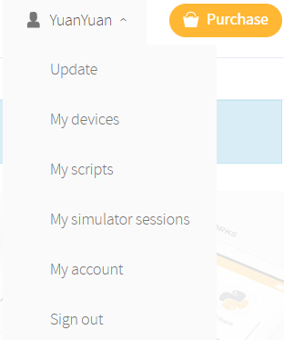

選擇 My Script 可以看到我存在線上的程式碼。

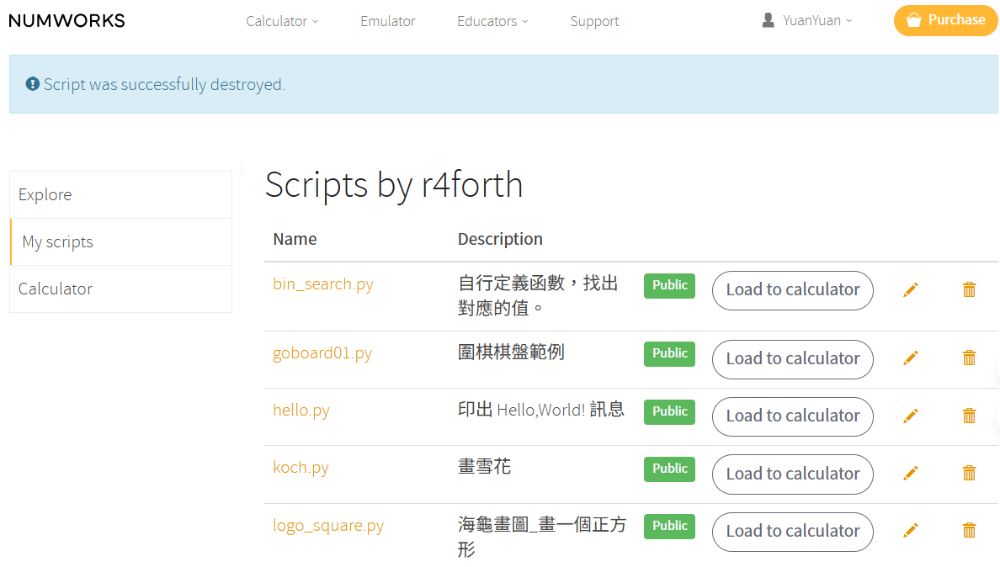

我這台計算機已經買了一陣子，利用這次鐵人賽來更新系統吧，選擇 **Updates**。

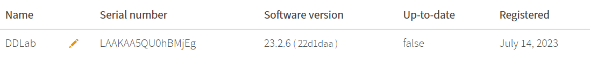

你會看到目前版本是 **23.2.6(22d1daa)** 版的韌體。

點選 **Update**

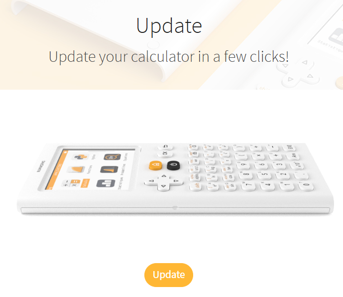

提醒你要將計算機連接到電腦。

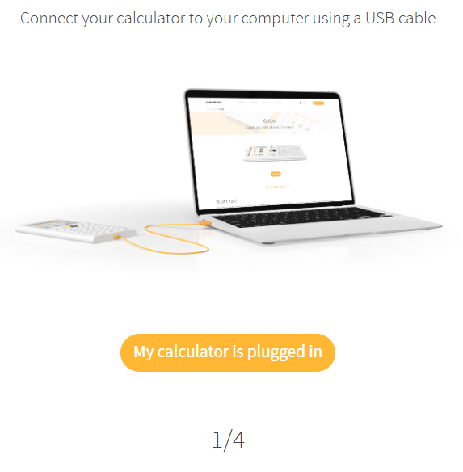

此時檢查計算機是否出現下列畫面

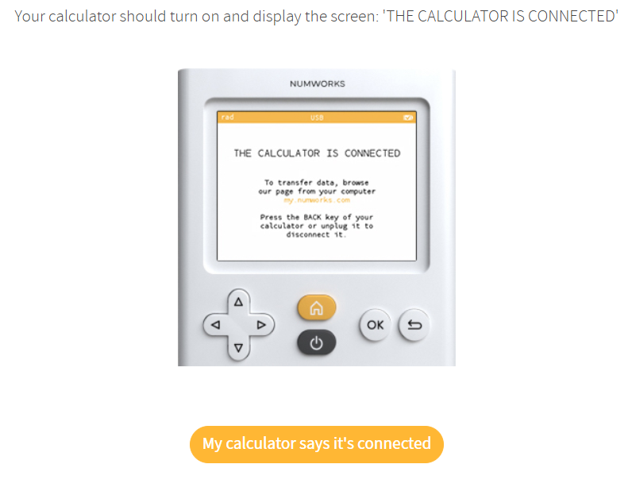

瀏覽器此時會出現一個小視窗，提醒你允許連接到這台計算機。

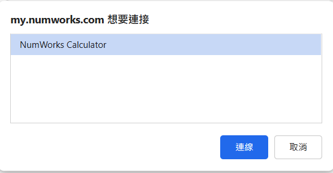

你會看到目前計算機的序號(Serial number) 與目前韌體版本(Current version)，點選 **Install the updates**，進行韌體更新。

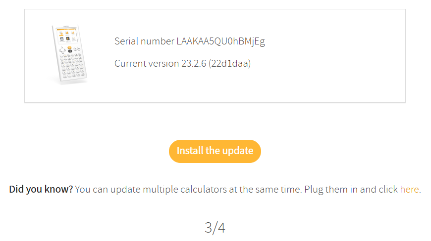

畫面會更新進度條，稍微等一下，就會更新完成。

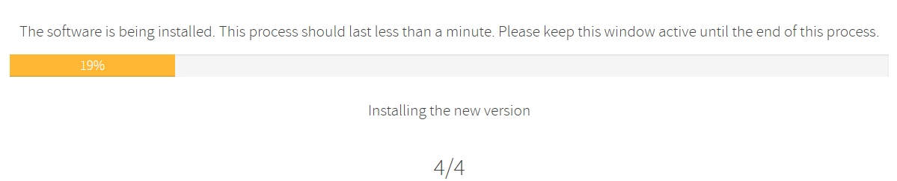

你已經將韌體更新。

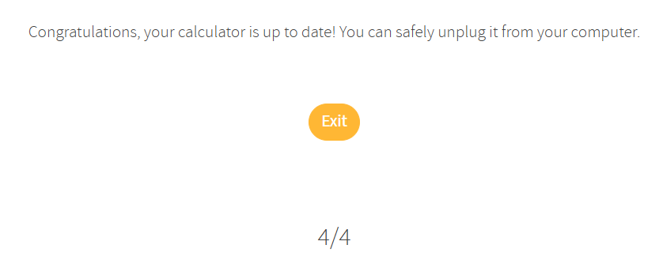

再一次檢視系統狀態，此時 **Up-to-date** 已經是 **true**。

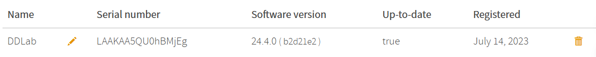

