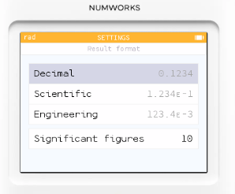
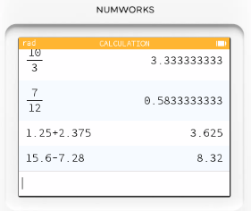
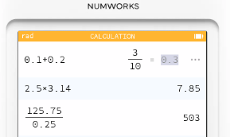
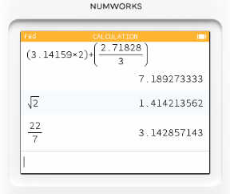
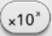
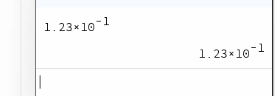
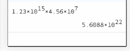
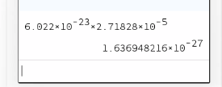

# 計算機模式_基本四則運算

## NumWorks 小數處理注意事項

### 小數顯示方式

在 設定 (Settings → Result format) 裡可以選擇：

- Decimal 		         0.1234
- Scientific             1.234e-1
- Engineering   		 123.4e-3	
- Significant figures    10

### 四捨五入與截斷

* NumWorks 在固定小數位數時，會採用 四捨五入，而不是截斷。
* 循環小數對於像 1/3 這類無限小數，NumWorks 會用近似值表示（例如 0.3333...）。
* 分數轉小數
> NumWorks會在需要時自動將分數轉為小數（例如設定為 Significant figures 4 → 6/7 = 0.8571）。

### 運算累積誤差

多次小數運算可能會有細微誤差，這是所有計算機都會遇到的浮點數問題。

📝 小數運算練習題（10 題）

這些題目可以在 NumWorks 上操作，觀察 不同顯示模式下的差異：

1. 10÷3
2. 7÷12
3. 1.25+2.375
4. 15.6−7.28

5. 0.1+0.2
6. 2.5×3.14
7. 125.75÷0.25

8. (3.14159×2)+(2.71828÷3)
9. 根號2
10. 22/7

# 計算機模式_科學記號的表示法

表示方式

一般科學記號會用 「aEn」 的格式來顯示科學記號，意思是 
1.234E-1 = 1.234 * 10 ^-1。

先輸入 1.234 ，然後使用  鍵，再使用方向鍵移動到次方位置，再輸入 -1，再按 exe 即完成輸入。

例如：

這種寫法跟電腦科學、科學計算機一致，方便處理大數或小數。

何時使用科學記號？

當數字 特別大（例如天文數字、工程數字）或 特別小（例如化學濃度、物理常數）

在 NumWorks 的設定 (Settings → Result Format) 裡選擇 Scientific，就會自動轉換。

例題 1：非常大的數字相乘

計算 1.23x10^15 * 4.56x10^7

例題 2：非常小的數字相乘

計算  6.022x10^-23 * 2.7182x10^-5

