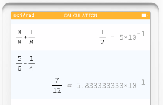
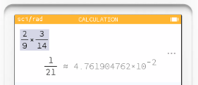
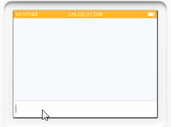
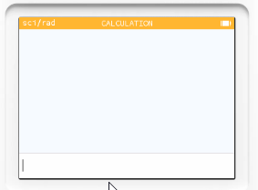
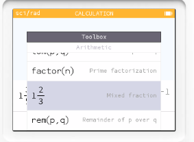
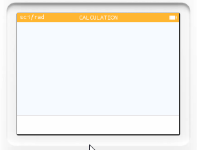
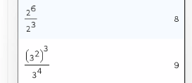
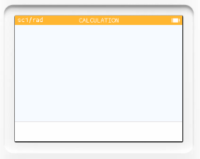
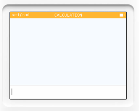

# 計算機模式_分數

1. $\frac{3}{8} + \frac{1}{8}$
   
2. $\frac{5}{6} - \frac{1}{4}$

3. $\frac{2}{9} * \frac{3}{14}$

4. $\frac{\frac{5}{12}}{\frac{10}{3}}$

5. $1\frac{3}{5} - \frac{7}{10}$

注意! 前面帶分數的輸入要搭配 工具箱鍵，選擇 **Arithmetic**，選取中間的 **Mixed fraction**。

# 計算機模式_指數

1. $2^3$
2. $5^5 + 3^6$

注意!次方的按鍵是 。

3. $10^3 - 2^5$

我們如果使用網頁瀏覽器輸入，次方可以使用 ^ 符號輸入，在 NumWorks 計算機中就會轉換成  這個功能鍵。

4. $2^6 / 2^3$
5. $(3^2)^3 / 3^4$

# 計算機模式_根號計算

1. $\sqrt{18} + \sqrt{8}$
2. $\sqrt{27} - \sqrt{12}$

## 連根號的輸入

3. $\sqrt{6+\sqrt{2}} * \sqrt{24}$

4. $\sqrt{1+\sqrt{2+\sqrt{3+\sqrt{4}}}}$

