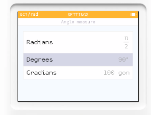
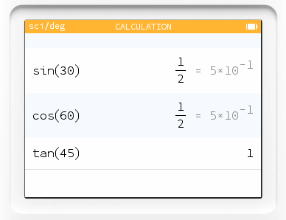
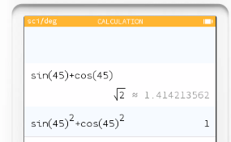
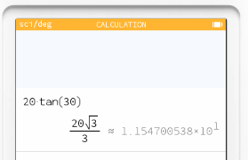
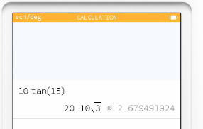
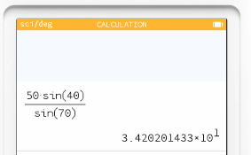
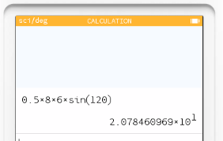
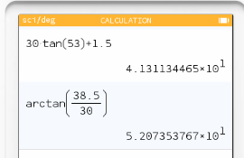

# 計算機模式_三角函數

計算三角函數基本題前，請先將角度單位改成 degree。

1. $sin30\degree$
2. $cos60\degree$
3. $tan45\degree$

4. 計算 $sin45\degree + cos45\degree$
5. 計算 $sin^2(45\degree) + cos^2(45\degree)$

6. 小明站在一棵樹前方 20 公尺處，仰角量得為 $30\degree$ 請問這棵樹大約有多高？

> $tan30\degree = \frac{h}{20}$
$h = 20\tan(30\degree)$

6. 某斜坡的角度是 $15\degree$，水平長度 10 公尺。請問斜坡的高度是多少？

> $tan15\degree = \frac{h}{10}$
> $h = 10 tan(15\degree)$

7. 小華站在河的一側，想測量對岸的一棵樹與自己的距離。
他先在河岸上往右走了 50 公尺，測得樹與起點的夾角為 $70\degree$，與終點的夾角$40\degree$請問這條河大約有多寬（起點到樹的距離）？

> 設起點 A，終點 B，樹的位置為 C。
已知 AB 線段長50， $\angle{CAB} = 70\degree$，$\angle{CBA} = 40\degree$
> 由三角形內角和：
> $\angle{ACB} = 70\degree$
> 由 **正弦定理** 可知:
> $\frac{AB}{\sin{\angle{acb}}} = \frac{AC}{\sin{\angle{CBA}}}$
> $AC = \frac{AB*\sin{40\degree}}{\sin{70\degree}}$

8. 在三角形 $ABC$ 中，已知 $AB = 8，AC = 6$ 且 $\angle{A} = 120\degree$。請問三角形的面積是多少？

> $S=\frac{1}{2}*AB*AC*\sin{\angle{A}}$
> $S=\frac{1}{2}*8*6*\sin{\angle{A}}$
> $S=24*\frac{\sqrt{3}}{2} = 12\sqrt{3}$

# 計算機模式_反三角函數

小美與一棟大樓的水平距離是 30 公尺。她測得大樓頂端的仰角是 $53\degree$。
請問：若她的眼睛高度為 1.5 公尺，這棟大樓大約有多高？

>設大樓總高度為 H，她眼睛與大樓頂端的高度差為 h。
>$\tan(53\degree) = \frac{h}{30}$
>$h = 30\tan(53\degree)$
>$H = h + 1.5$

假設已知 大樓高度 $𝐻=40$ 公尺、觀測點水平距離 30 公尺，請計算「仰角θ」。

> $\tan{\theta} = \frac{H-15}{30}$
> $\theta = \arctan(\frac{38.5}{30})$

