# 計算機模式_對數

當納皮爾發明對數表後，數學家與科學家終於從繁複的計算過程中釋放。高中數學有一個章節就是用對數處理複雜計算的問題。我們來看看底下的例子:

1. $\log_2{32}$
2. $\log1000-\log10$

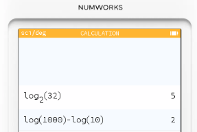

解指數方程式:

1. $2^x = 7$ ，求 x = ?

>取對數 $x=log_2​{7}$

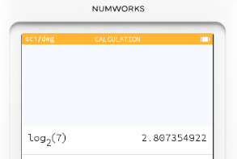

2. $2^{x+1} + 4^{x-1} = 5(2^x) - 6$

> 因為 $2^x > 0$ ，所以 $2^x=6−2\sqrt{3}$ ​或 $2^x=6+2\sqrt{3}$
> $x=\log_2(6-2\sqrt{3})$ 或 $x=\log_2(6+2\sqrt{3})$
​
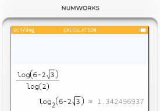

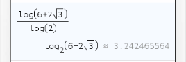

應用問題

小華在銀行存入 10,000 元，年利率 5%，每年複利一次。請問：大約需要 多少年，本金會翻倍（達到 20,000 元）？

> $累積金額 = 本金(1+r)^t$
> $20000 = 10000(1.05)^t$
> $t =log_1.05{2}$

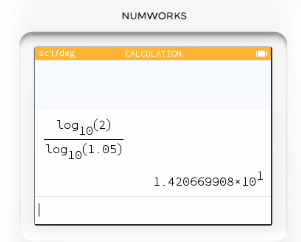

# 計算機模式_自然對數

1. $ln{e}^3$
2. $log_5{7}$

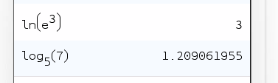

3. $e^{2x}=7$

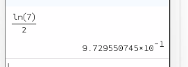

4. 某筆資金以 連續複利 方式投資，年利率 $5%$。請問經過多少年，本金會成長為原本的 3 倍？

> $A = Pe^{rt}$
> 已知 $A/P=3， r = 0.05$
> $3 = e^{0.05t}$
> $t = \frac{ln3}{0.05}$

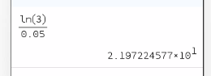

# 計算機模式_常用常數

| 常數     | 名稱      | 在 NumWorks 輸入方式         | 備註               |
| ------ | ------- | ----------------------- | ---------------- |
| $\pi$  | 圓周率     | `π`（直接在鍵盤有專屬按鍵）         | 約 3.14159        |
| $e$    | 自然對數的底數 | `e`（工具列選單裡找到，或直接輸入字母 e） | 約 2.71828        |
| $i$    | 虛數單位    | `i`（工具列 Complex 選單）     | 滿足 $i^2=-1$      |
| Ans    | 上一次計算結果 | `Ans`                   | 可直接延續前一個答案       |
| Random | 隨機數     | `rand()`                | 會給 0 到 1 之間的隨機小數 |

## 工具箱內建的常數

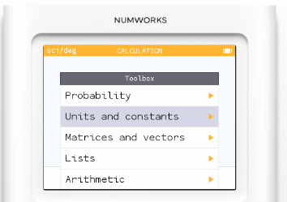

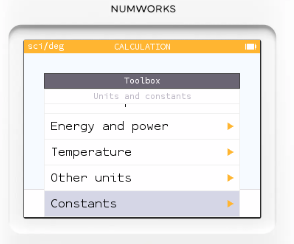

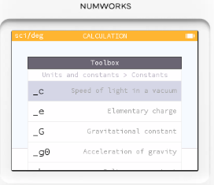

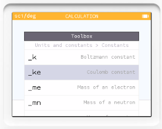

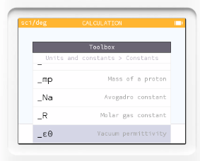

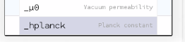
