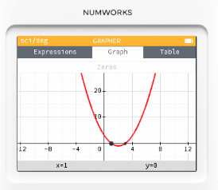

# 繪圖模式：繪製單一函數圖形

## 繪圖模式_繪製直線方程式

1. 在主選單進入 **Grapher**。

   

2. 點選 **Add an element**，輸入 $3x+5$，就會建立一條方程式。

   

3. 後面有三個點，這是可以調整其他屬性的設定。
   * Color 更換線條顏色
   * Plot restriction 指定繪圖範圍
   * Delete expression 刪除方程式
  
   

4. 點選 **Plot graph**，就可以畫出直線方程式。

移動方向鍵，可以沿著直線方程式移動，你可以查看 X 與 Y 的值。

**Calculate** 有更進階的功能

**Table** 可檢視座標點數值

## 繪圖模式_繪製二次曲線

1. 在主選單進入 **Grapher**。
2. 點選 **Add an element**，輸入 $x^2-4x+3$，就會建立一條拋物線。

1. 按 OK(EXE) 鍵，點選 **Graph** 繪圖。
   

1. 點選 **Graph** 標籤，可開啟進階功能，選擇 **Find**，選擇 **Zeros**，可以找到 $y=0$ 對應的 x 值，x =1 或 3。 

測試
