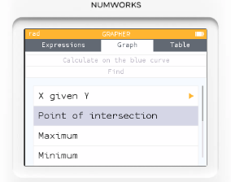

# 繪圖模式_多函數繪圖

我們可以用 Numworks 計算機來畫多個函數圖形，舉例來說

* $f_1(x) = x^2-4x+1$
* $f_2(x) = 2x-3$

1. 首先進入到 Grapher 應用程式內，在第一條方程式中輸入 $x^2-4x+1$
2. 在第二條方程式中輸入 $2x-3$
   
3. 點選底下的 **Plot graph**，畫出圖形。
4. 此時移動到上方 Auto Axes Navigate Calculate 選單。
5. 選擇 **Calculate** 底下的任意一條方程式的選項
6. 將下拉選單選到 **Find** / **Point of intersection**，就會計算出兩條方程式的交點。

你也可以沿著方程式前進，找到與另外一條方程式相交的點。

# 繪圖模式_座標系統操作

1. 預設是直角座標系統，水平方向是 X 軸，垂直方向是 Y 軸。
2. 使用方向鍵來移動游標。
3. OK 或 EXE 鍵用來確認當前位置，例如標記點，讀取座標等。
4. 切到 **Navigate** 選項時，可利用 +, - 鍵來放大或縮小畫面。
5. 也可切到表格模式，查看指定 X 值時，相對應的 Y 座標值。
6. 切到 **Calculate** / **Find** 選項時，有基本的座標點計算工具:
   1. X given Y （已知 Y 求 X）
   2. Point of intersection （交點）
   3. Maximum （極大值）
   4. Minimum （極小值）
   5. Zeros (找曲線與 x 軸的交點)
   6. Tangent （找出切線）
   7. Integral （積分）
   8. Area between curves （兩曲線之間的面積）

