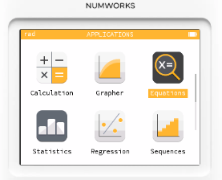
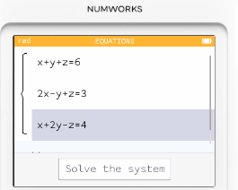
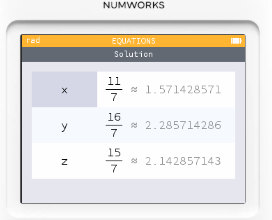
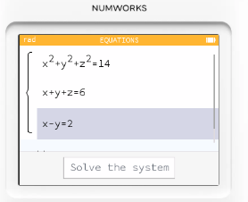

# 函數模式_方程組計算

## 求解方程組

1. 在主選單選擇 **Equations**

2. 點選  **Add an equation**，加入你要的方程式，系統有內建一些範本。
3. 輸入方程組

4. 解方程組 (Solve equations)
5. 求得 X, Y, Z 的值。

## 解三元二次方程組

計算機功能限制：
Numworks 計算機主要針對中學代數和幾何運算所設計，其內建功能不支援解更複雜的多項式方程組。
需要進階方法：

解三元二次方程組通常需要使用多種代數技巧，例如：
* 代入消去法: ：從一個方程中解出一個變數，然後代入其他方程來簡化問題。
* 加減消去法: ：將方程乘以常數後相加或相減，以消去某些變數。
* 因式分解: ：如果方程組可以因式分解，可以將其轉化為更簡單的方程。
* 數值方法: ：在某些情況下，可能需要使用數值迭代方法來逼近解。

使用專業軟體：

如果您需要解這類複雜的方程組，建議使用電腦軟體，如MATLAB、Wolfram Alpha 或其他的專業代數求解器。