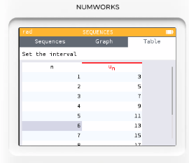
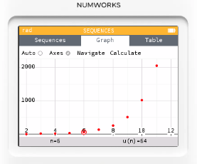

# 序列模式: 等差、等比、遞迴數列

## 基礎使用等差數列

1. 點選主螢幕 **Sequences**
2. 新增一個序列，$U_n=2n+1$
3. 點選 **Plot graph** 就能會出圖形。

4. 選擇 **Display values**，就可以查看序列數值表。

## 等比數列

## 費波那契數列（遞迴）

$U_0=0，U_1=1,U_{n+2}=U_{n+1} + U_n$

設定項次從0開始

## 收斂數列

計算 $\sqrt{2}$ 的牛頓迭代法

$U_0=1, U_{n+1} = \frac{U_n}{2}+\frac{1}{U_n}$

