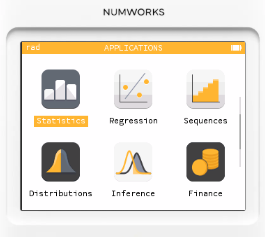
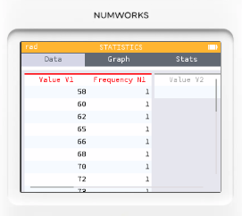
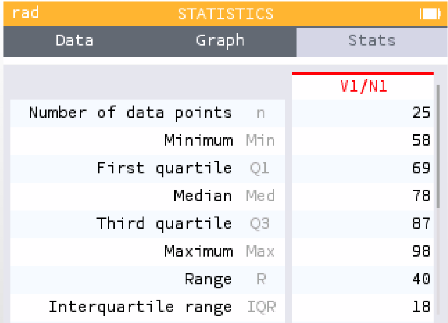
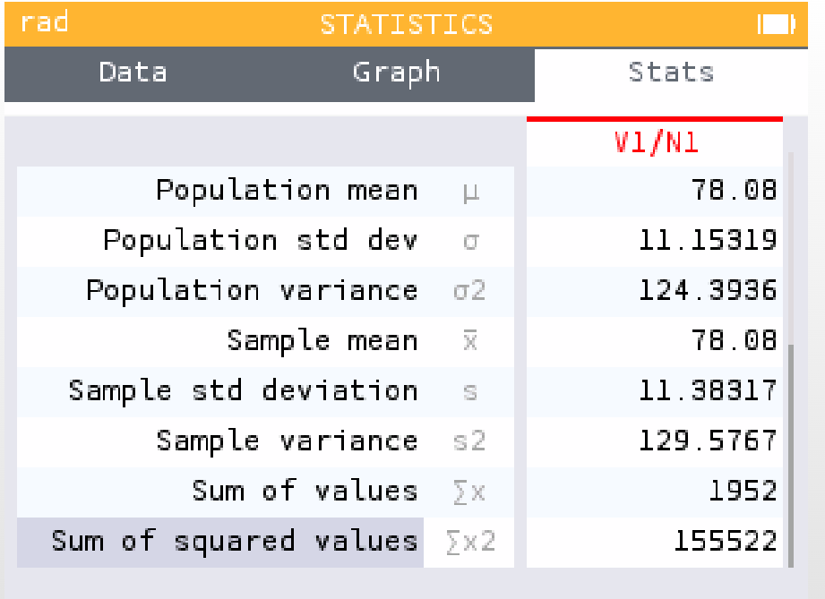
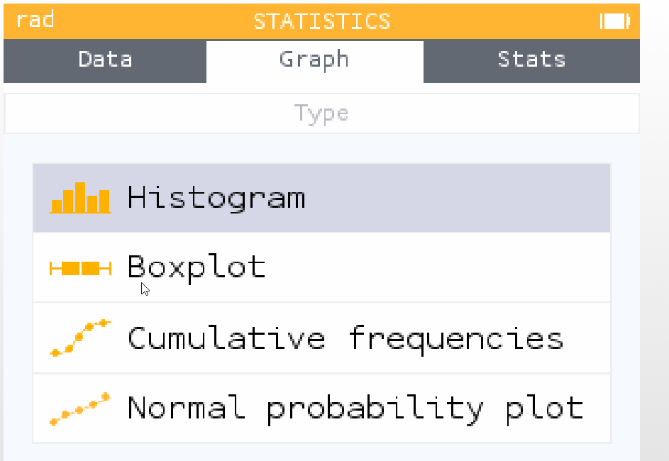
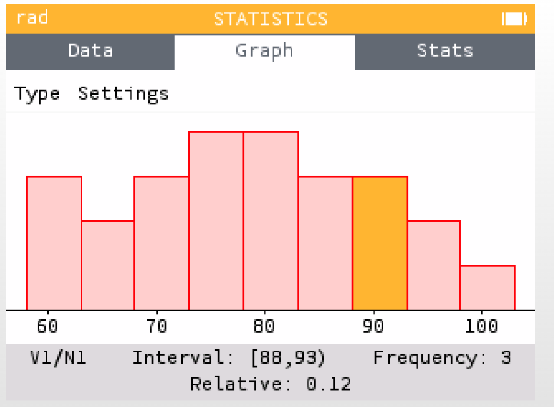
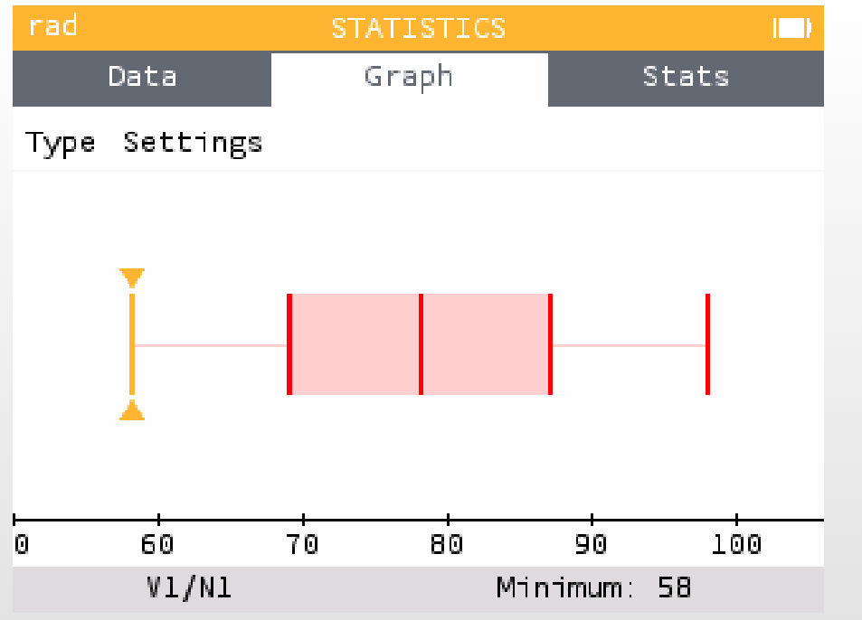
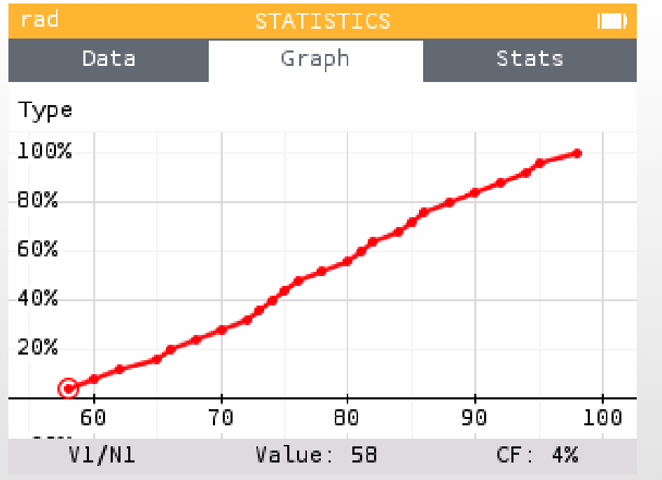
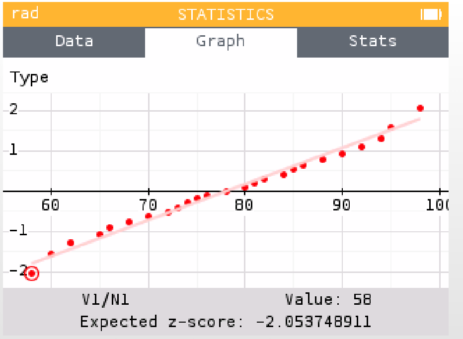

# 統計模式：資料輸入與平均數計算

## 資料輸入

國中二年十一班25位同學的數學月考成績為

```
58, 60, 62, 65, 66,
68, 70, 72, 73, 74,
75, 76, 78, 80, 81,
82, 84, 85, 86, 88,
90, 92, 94, 95, 98
```

1. 主選單，選擇 **Statistics** 統計功能。


2. 預設會看到一個資料表 **V1, N1**
   * V1 是資料（分數）
   * N1 是出現次數（如果每筆資料只有一次出現，就不用填，預設 =1）。

3. 依序輸入資料，然後按 EXE。
4. 點選 **Statistics**，檢視統計量

   * 樣本數 Number of data points
   * 最小值 Minimum
   * 第一四分位數 First quartile
   * 中位數 Median
   * 第三四分位數 Third quartile
   * 最大值 Maximum
   * 全距 Range
   * 四分位距 IQR. Interquartile rande

   * 母體平均數 Population mean
   * 母體標準差 Population std dev
   * 母體變異數 Population variance
   * 樣本平均數 Sample mean
   * 樣本標準差 Sample std deviation
   * 樣本變異數 Sample variance
   * 數值總和 Sum of values
   * 平方和 Sum of squared values

5. 點選 **Graph**，有四種圖形可繪製

6. 直方圖

7. 箱型圖

8. 累積頻率

9. 常態機率圖



* 直方圖（Histogram）在成績計算上的用途，就是把一群學生的分數，用「區間」來分類，再用長條的高度表示每個區間有多少人。
   - 快速看出分布：一眼就能知道分數集中在哪裡，像是大部分人考在 70–80 分。
   - 比較差異：可以看出成績是「常態分布」（像小山丘，中間多、兩邊少）還是「偏態分布」（成績偏高或偏低）。
* 箱型圖（Boxplot，又叫盒鬚圖）是一種把「成績分布」濃縮成幾個關鍵點的圖表。它主要看 四分位數，也就是把成績切成四等份。
   - 可以快速看出 整體分布：分數集中在哪裡、是否偏高或偏低。
   - 中位數 告訴你大部分學生的中心成績。
   - 箱子的寬度（IQR） 代表中間 50% 學生的分散程度。
* 「累積頻率」就是把成績分布的統計往前一直累加，讓你看到「有多少人分數在某個區間以下」。
   - 你可以很快知道 及格率（例如算 60 分以下有幾人）。
   - 可以看出 某分數以下的人數比例，像「80 分以下有 14 人」表示前 70% 的人都落在這範圍。
   - 畫成 累積曲線圖，可以清楚看到全班成績的累積分布狀況。
* 常態機率圖（Normal Probability Plot） 是一種檢查「成績分布是不是接近常態分布（鐘形曲線）」的圖表。
   - 如果點大致排成一條直線 → 表示成績分布接近常態分布（很平均，像鐘形曲線）。
   - 如果點偏離直線 → 表示分布不是常態，例如：太多高分或太多低分。
   - 極端的點 → 可以看出是不是有「離群值」，像特別高分或特別低分的學生。