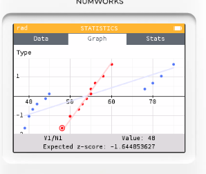

# 統計模式: 標準差與變異數

## 便利商店營運比較問題

QK 便利商店有兩家分店：

* A 店（商辦區）：平日上班族多，客流穩定，週末略降。
* B 店（觀光景點旁）：平日人少，週末觀光客爆量，波動大。

連續 10 天的單日營業額（單位：千元）如下：

* A 店：52, 55, 54, 53, 56, 50, 48, 60, 58, 55
* B 店：40, 42, 45, 70, 68, 39, 41, 75, 72, 44

用 NumWorks 計算，判斷哪家店「平均營業額較高」與「穩定度較好（分散較小）」；並用箱型圖觀察是否有明顯離群情形。

### 計算方法

1. 按 Home → 統計。
2. 在 資料集 1 輸入 A 店 10 筆，在 資料集 2 輸入 B 店 10 筆。

3. 按 OK → 度量：讀取各自的 平均數（Mean）、標準差（σ 或 s）、中位數、Q1、Q3、IQR。
 
 
4. 按 OK → 圖表 → 箱型圖：切到「資料集 1 / 2」比對箱體寬度（IQR）與中位數位置，留意是否有離群點。
 
 
5. 看直方圖：比較兩店分布是否集中或多峰。

### 查看數據

* 平均數：
  - A 店 ≈ 54.1 千元
  - B 店 ≈ 53.6 千元（兩者相近）
* 樣本標準差（穩定度指標，愈小愈穩）
  - A 店 ≈ 3.57 千元（很穩定）
  - B 店 ≈ 15.39 千元（波動大）

* 四分位資訊：
  - A 店：Q1 ≈ 52、Q2 ≈ 54.5、Q3 ≈ 56，IQR ≈ 4
  - B 店：Q1 ≈ 41、Q2 ≈ 44.5、Q3 ≈ 70，IQR ≈ 29
→ B 店箱體明顯更寬，代表中間 50% 的營收變化很大。

* 以 1.5×IQR 規則判定，兩店此資料 無明顯離群點，但 B 店呈現「平日低、週末飆」的多峰/偏態特徵。

 

### 結論

* 平均營業額：A、B 差不多（A 略高）
* 穩定度：A 店明顯更穩定（標準差與 IQR 都小很多）。
* 經營解讀：
  - A 店適合「穩定補貨與人力排班」；- B 店需「週末加派人力、備貨彈性與活動檔期規劃」。