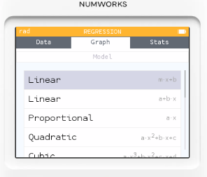

# 統計模式: 散佈圖繪製

## 題目情景

某便利商店想研究每天氣溫(°C)與思樂冰飲銷售量(杯數)的關係。他們記錄了六月連續 20 天的資料：

* 天氣溫度 (X, °C): 18,	19, 20,	21,	22,	23, 24,	25,	26,	27,	28,	29,	30,	31,	32,	33,	34,	35,	36,	37
* 思樂冰銷量 (Y, 杯): 45, 48, 50, 52, 55, 57, 59, 62, 65, 68, 72, 75, 79, 82,	85, 90, 94,	98,	102, 108

共有 20 組 (X, Y) 資料。

## 處理步驟

1. Home → 選「Statistics」選項。
2. 預設會看到一個表格，第一欄標示 V1，第二欄 N1。
 - V1 我們拿來放 溫度 (°C)。
 - N1 我們拿來放 銷量 (杯數)。
3. 開始逐格輸入：
 - 在 V1 的第一列輸入 18，再移到右邊 N1 輸入 45。
 - 接著 V1=19, N1=48，依序輸入下去。
 - 直到最後一組 V1=37, N1=108。

## 結論

* 你會看到資料點大致落在一條「斜向上的直線」附近。
  

* 這代表溫度越高，冰飲銷量越多，是一個正相關。
* 如果做線性回歸，會得到一條近似公式，例如：

  
  
  
    
    銷量 ≈ 3.23× 溫度 − 16.57

這公式可以用來預測：例如氣溫 33°C，大約會賣 90 杯。

