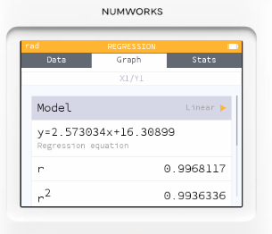

# 統計模式: 線性回歸與相關係數

## 題目情境

一家書店老闆想知道「宣傳廣告費用」和「單日營業額」之間是否有關。他記錄了 8 天的數據（單位：千元）：

* 廣告費用 (X)	2,	4,	5,	6,	8,	10,	12,	15
* 營業額 (Y)   20, 28, 30, 32, 36,	42,	47,	55

問題：

1. 找出「廣告費用 → 營業額」的迴歸公式。
2. 檢視 相關係數 r，並解釋兩者的關係。

## 操作步驟:

1. 輸入資料
    * 回到 Home → 統計 App。
    * 在 X1 輸入廣告費用數據（2, 4, 5, 6, 8, 10, 12, 15）。
    * 在 Y1 輸入營業額數據（20, 28, 30, 32, 36, 42, 47, 55）。
    
2. 查看散佈圖
    * 按 OK → 圖表 (Graphs) → 選擇「散佈圖」。
    * 可以看到點大致呈直線往上。
    
3. 做迴歸分析
    * 在圖表畫面，按 選單 → 回歸 → 線性回歸。
    * NumWorks 會顯示公式，例如：
    $$ y = 2.573x + 16.309$$
    
4. 檢視相關係數 (r)
    * 在回歸結果下方會顯示 r ≈ 0.99。
    * 這代表廣告費用和營業額之間有非常強的正相關。

## 解釋與應用

* 迴歸公式：營業額 ≈ 2.573 × 廣告費用 + 16.3
→ 意思是：廣告每增加 1 千元，營業額大約會多 2.6 千元。
* 相關係數 r ≈ 0.99：接近 1，代表兩者有高度線性關係。
* 商業應用：老闆可以依此公式預測：若投放 7 千元廣告，營業額大概會落在 33 千元左右。