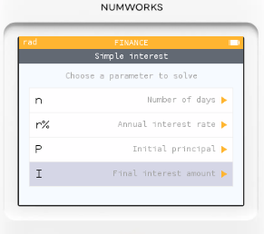

# 財務模式: 單利與複利計算

「貼近台灣現況」的房貸情境題，並用固定利率分別以「單利」與「（一般銀行採用的）本息平均複利攤還」來比較總利息。假設目前房貸平均利率為 $2.30%$

* 屋價：1,500 萬
* 貸款成數：8 成 ⇒ 本金 $P 為 1,200 萬$
* 期數：30 年 ⇒ $𝑛 = 360 月$
* 固定年利率： $𝑟 = 2.30%$（參考五大行庫平均）

## 單利計算

$總利息=P×r×年數=12,000,000×0.023×30=8,280,000 元$

單利等於一直用「原始本金」計息，不隨還款遞減，所以總利息偏高（僅作概念比較）。

### 操作步驟

1. 到 Finance 功能，選擇「Simple interest」。
   
2. 選擇 I (Final intesest amount) 最後的利息總額
   
3. 輸入參數   因為單利的計算基礎是 $30 * 365(天) =  10950 (天)$
   
4. 最後利息總額為 828 萬
   

## 複利計算

* 月利率 $𝑖=\frac{𝑟}{12}=\frac{0.023}{12}$
* 月付金：
$$𝑀=𝑃⋅\frac{𝑖}{1−(1+𝑖)^−𝑛}$$
代入得 $𝑀≈46,176 元／月$

30 年總繳： $𝑀×360 ≈ 16,623,416 元
因此總利息： $16,623,416 - 12,000,000 = 4,623,416元$

  
   
  
  

## 結論

以同樣 2.30% 固定年利率、30 年期，複利攤還的總利息（約 462 萬）遠低於單利（828 萬），因為複利攤還每月都在還本金，未來計息基礎會越來越小。