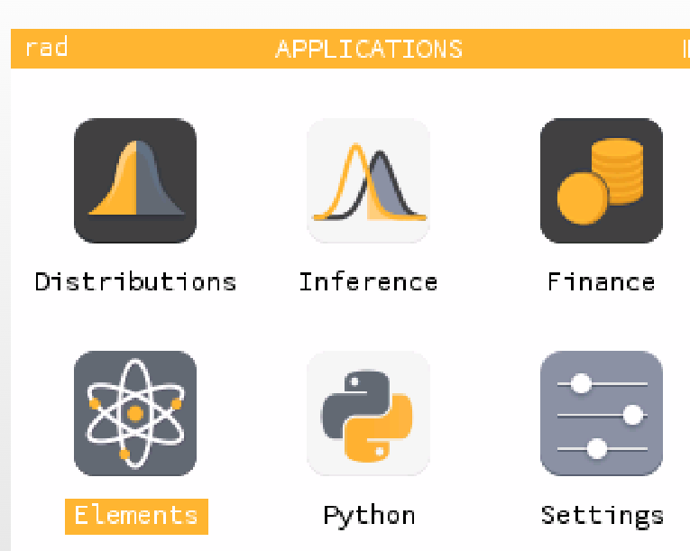
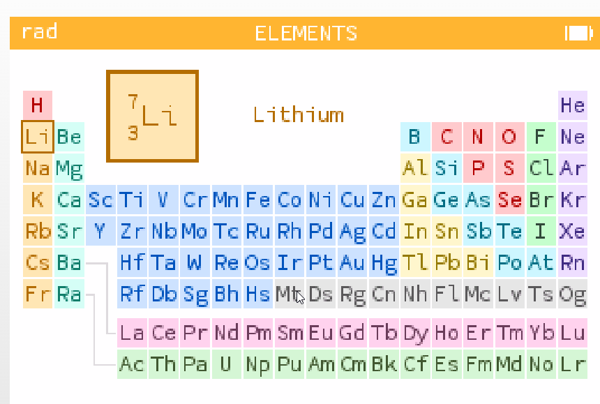
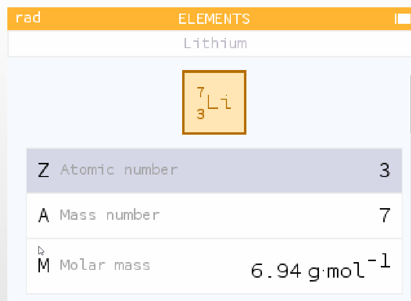
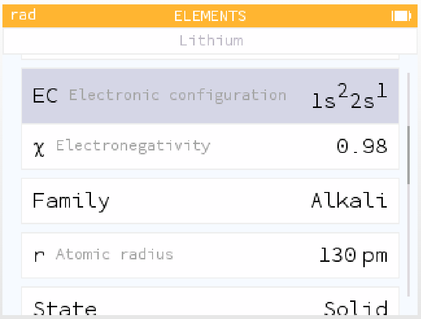
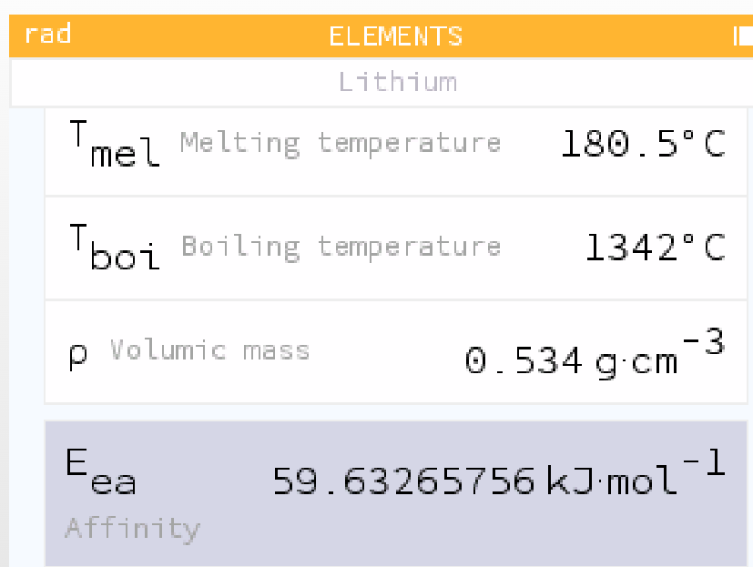
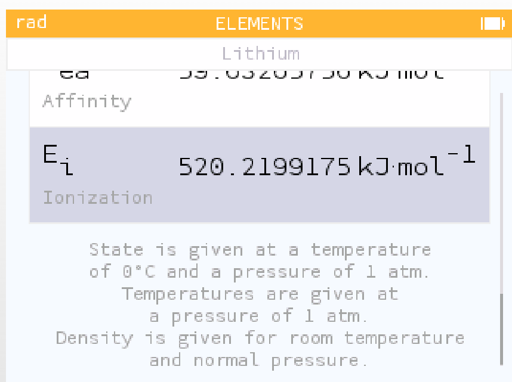
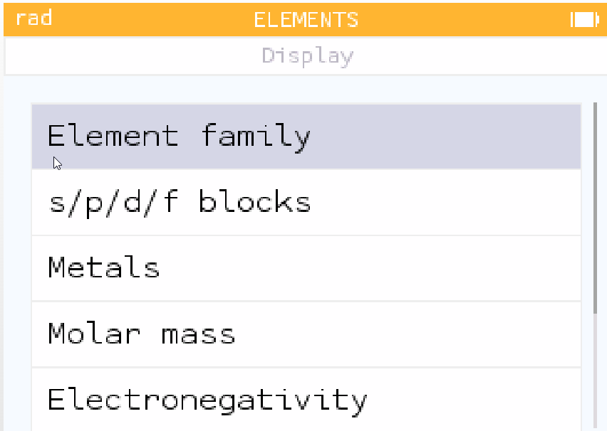
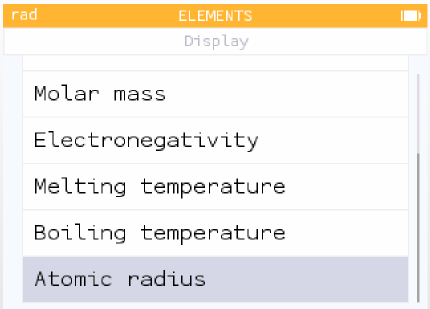

# 週期表模式: 元素週期表與相關功能介紹

## 元素週期表

Numworks 內建了一個元素週期表(Elements)軟體

我們就用 **鋰** 這個元素來解釋這軟體要怎麼使用

* Lithium → 鋰（元素名稱）
* 方格圖：
  * 上方 7 → 質量數 (Mass number)：指最常見同位素的質子數 + 中子數 ≈ 7。
  * 下方 3 → 原子序 (Atomic number, Z)：鋰的原子序是 3，代表鋰原子有 3 個質子。
  * Li → 元素符號（Lithium）。
* Z Atomic number: 3
    → 原子序 (Z) = 3，決定它在週期表的位置，也代表電子數（中性原子時）。
* A Mass number: 7
    → 質量數 (A) = 7，表示鋰的主要同位素 Li，由 3 個質子 + 4 個中子組成。
* M Molar mass: 6.94 g·mol⁻¹
    → 莫耳質量 (M) = 6.94 克/莫耳，意思是 1 莫耳($6.022×10^23$個原子）的鋰，質量大約是 6.94 克。

## 化學性質

 

* EC Electronic configuration: 1s² 2s¹
    → 電子排布：鋰有 3 個電子，分布在軌域為 1s² 2s¹。意思是：
    * 1s 軌域有 2 個電子
    * 2s 軌域有 1 個電子
    → 這反映鋰是 第 2 週期、第一族的鹼金屬，最外層只有 1 個價電子。
* χ Electronegativity: 0.98
    → 電負性：鋰的電負性為 0.98（Pauling 標度）。電負性愈低，愈容易失去電子 → 鋰是活潑的金屬，常形成 Li⁺。
* Family: Alkali
    → 族群：鹼金屬 (Alkali metals)。這族包括 Li, Na, K, Rb, Cs, Fr，全都有一個價電子，化學性質相似，容易和非金屬（如氯、氧）形成離子化合物。
* r Atomic radius: 130 pm
    → 原子半徑：130 皮米 (pm)。這表示鋰原子的大小，相對於其他元素，它算是中小型。隨族往下走（Na, K, Cs），原子半徑會愈來愈大。
* State: Solid
    → 物質狀態：固態（常溫常壓下）。

## 物理性質

* Tₘₑₗ Melting temperature: 180.5 °C
    → 熔點：180.5 °C
    鋰在 180.5 °C 開始由固體轉為液體。相對於許多金屬（如鐵 1538 °C），鋰的熔點很低，這也是鹼金屬的共通特色。
* Tᵦₒᵢ Boiling temperature: 1342 °C
    → 沸點：1342 °C
    鋰在 1342 °C 由液體轉為氣體。相較於熔點，沸點高很多，顯示鋰金屬液態仍有強烈的金屬鍵作用。
* ρ Volumic mass: 0.534 g·cm⁻³
    → 密度：0.534 g/cm³
    這數值比水 (1.0 g/cm³) 還小，代表鋰能 浮在水面 上（但會立刻與水反應）。鋰是密度最小的金屬之一。
* Eₑₐ Affinity: 59.63 kJ·mol⁻¹
    → 電子親和能：59.6 kJ/mol
    表示鋰原子接受一個電子形成 Li⁻ 時所釋放的能量。數值不算高，因為鋰傾向 失去電子變 Li⁺，而不是吸收電子。
* Eᵢ Ionization: 520.2199175 kJ·mol⁻¹
    → 電離能 (Eᵢ) = 520 kJ/mol
    這代表把 1 莫耳的鋰原子（氣態、基態） 各移除一個電子（形成 Li⁺）所需吸收的能量。

    * 單位：kJ/mol（每莫耳原子所需能量）。
    * 數值偏低，符合「鋰很容易失去價電子，成為 Li⁺」這個鹼金屬的特性。
    → 「物質狀態是以 0 °C、1 個大氣壓條件下給定。」
    → 「熔點、沸點等溫度數據，是以 1 個大氣壓為基準。」
    → 「密度是以室溫、標準氣壓下測得。」

## 使用顏色或特性分類表

* Element family
    → 元素家族分類
    在週期表中用顏色區分各族，例如鹼金屬、鹼土金屬、過渡金屬、稀有氣體等等。這樣可以一眼看出同族元素的規律性。
* s/p/d/f blocks
    → s/p/d/f 區塊
    根據元素最外層電子所在的軌域，將元素分為 s 區、p 區、d 區、f 區。例如：鋰屬於 s 區，氯屬於 p 區，鐵屬於 d 區。這種分法在學電子排布時特別重要。
* Metals
    → 金屬/非金屬/類金屬
    以顏色標示元素是屬於金屬、非金屬或類金屬。這樣能快速辨認元素性質上的大分類。
* Molar mass
    → 莫耳質量（原子量）
    在週期表顯示每個元素的莫耳質量數值，例如鋰是 6.94 g/mol。這對化學計算（摩爾轉換）很實用。
* Electronegativity
    → 電負性
    在週期表顯示各元素的電負性（Pauling 標度），讓你看到週期性的變化：往右電負性增大，往下減小。

* Molar mass
    → 莫耳質量（原子量）
    在週期表顯示元素的平均原子質量（例如鋰 6.94 g/mol）。對計算化學反應中摩爾數特別重要。
* Electronegativity
    → 電負性    
    在週期表顯示各元素的電負性數值，方便觀察「往右上增加、往左下減少」的週期性趨勢。
* Melting temperature
    → 熔點
    顯示每個元素的熔點，觀察金屬 vs 非金屬的差異，例如鹼金屬熔點低、鎢的熔點極高。
* Boiling temperature
    → 沸點
    顯示元素的沸點，可以用來比較金屬鍵/分子間作用力強弱。
* Atomic radius
    → 原子半徑
    顯示元素的原子半徑大小。這對理解週期性變化很重要：
    * 同一週期由左到右：原子半徑減小（因為核電荷增加）。
    * 同一族由上到下：原子半徑增加（因為電子層數增加）。