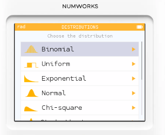
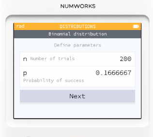
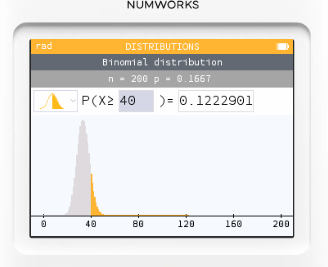
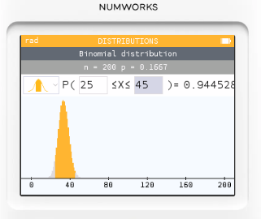

# 機率分佈：擲骰子、二項分佈與期望值

## 擲骰子問題

公平六面骰連續擲 200 次。令  X = 出現「6」的次數。
1. 求 $𝑃(𝑋≥40)$。
2. 求 $P(25≤X≤45)$。
3. 說明期望值與標準差的意義。

## 解題步驟

1. Home → Distributions（機率分佈）。

2. 選 Binomial（二項分佈）。

3. 設參數：n = 200、p = 1/6（擲一次出現 6 的機率）。

4. 按 Compute：
    * (1) 在條件選 $X≥k$，輸入 k = 40，讀出 P(X≥40)。
  
    

    * (2) 在條件選 $a≤X≤b$，輸入 a = 25, b = 45，讀出機率。

    

參考數值

* P(X≥40)≈0.1223（約 12.23%）。
* P(25≤X≤45)≈0.9445（約 94.45%）。

## 期望值與變異（順便可在「計算機」App 用公式算）

* 期望值 $E[X]=np=200×\frac{1}{6}=33.33$。
    * 意義：擲 200 次，平均而言大概會出現 33 次左右的「6」。
* 變異數 $Var(X)=np(1−p)=200⋅\frac{1}{6}⋅\frac{5}{6}
* 標準差 $𝜎=\sqrt{𝑛𝑝(1−𝑝)}≈5.27$
    * 意義：實際次數多半落在 $33.33±1𝜎$（約 28～38）附近；落在 $±2σ$（約 23～44）內的機率很高，與上面第 (2) 題的結果一致。

結論：

二項分佈 B(200,1/6) 下，出現 6 的次數大多圍繞在期望值 33 次附近，40 次以上屬於較少見但仍可能的情況（約一成多機率）。