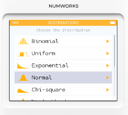
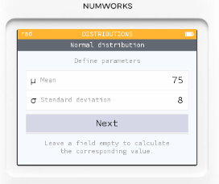
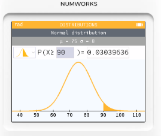
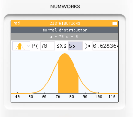

# 機率分佈: 常態分佈

## 題目情境

某班級的數學考試成績近似服從常態分佈：
* 平均數（μ）= 75 分
* 標準差（σ）= 8 分
* 班級人數 = 50 人

問題：  這班大約有幾個學生能考到 90 分以上？

## 解題步驟

1. 標準化計算 (Z 分數)

$$𝑍 =\frac{90−75}{8}=\frac{15}{8}=1.875$$

2. 查常態分佈機率
    * NumWorks 操作：
      * Home → Distributions → Normal
      * Mean = 75, Standard deviation = 8
      * Compute → Condition: $𝑋≥90$
    * 得到 $P(X≥90)≈0.0304$（約 3.04%）。
    
    
3. 期望人數

$$期望人數=P(X≥90)×50≈0.0304×50=1.52$$

大約 1–2 人 會考到 90 分以上。

這表示 90 分在這班算「極高分段」，屬於少數菁英區。

## 有多少學生會落在 70 到 85 分之間?

1. 計算 Z 分數

* 對 70：

$$𝑍_1 = \frac{70 − 75}{8} = −\frac{5}{8} = 

* 對 85：

$$𝑍_2 = \frac{85 − 75}{8} = \frac{10}{8} = 

2. 查常態分佈機率（NumWorks 上操作）

* Home → Distributions → Normal
* Mean = 75, Standard deviation = 8
* Compute → Condition: $70 ≤ 𝑋 ≤ 85$
* 得到 $P(70≤X≤85)≈0.628364（約 62.83%）$。

3. 轉換成人數

$0.6283×50≈31.4$

結論:

大約 31 位學生 的分數會落在 70 到 85 分之間。
這表示班上有超過一半的學生集中在這個「中高分」區間，成績分布算是偏穩定的。
