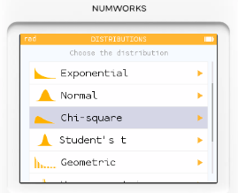
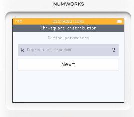
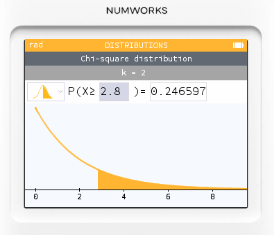

# 機率分佈: 卡方分佈

## 題目情境 

某牧場主懷疑飼料種類會影響奶牛的產奶量，於是設計了一個小實驗：

* 分三組，每組各 20 頭奶牛，飼料分別是 A、B、C。
* 期望每組產奶「高產」與「普通」的比例應該 沒有差異。

實驗觀察結果如下：

| 飼料種類 | 高產 | 普通 | 合計 |
| ---- | -- | -- | -- |
| A    | 12 | 8  | 20 |
| B    | 7  | 13 | 20 |
| C    | 11 | 9  | 20 |

問題：這三種飼料是否真的產生不同效果？請用 卡方檢定計算檢定統計量，並用 NumWorks 找到對應的機率。

## 為什麼適用卡方分佈？

* 卡方檢定 (Chi-square test) 適用於「類別資料」的比較，例如：
  * 觀察到的次數 vs. 預期次數。
  * 判斷不同組別是否有差異。

在這裡，「高產/普通」是 類別變數，「飼料種類」也是分類依據，剛好就是卡方檢定的典型應用場景。

## 計算過程

1. 期望次數 (Expected counts)
    總計：高產 = 30，普通 = 30。    
    每組總數 = 20，所以期望每組分布應該是 高產 10、普通 10。
2. 卡方統計量公式

$$𝜒^2=\sigma\frac{(𝑂−𝐸)^2}{𝐸}$$
	​
計算：
    * A 組：$(12−10)^2/10+(8−10)^2/10=0.4+0.4=0.8$
    * B 組：$(7-10^2/10 + (13-10)^2/10=0.9+0.1.8$
    * C 組：$(11-10)^2/10+(9-10)^2/10=0.1+0.1=0.2$
    * 合計 $𝜒^2=0.8+1.8+0.2=2.8$

3. 自由度

$(行數−1)×(列數−1)=(3−1)×(2−1)=2$

## NumWorks 計算步驟

1. Home → Distributions → Chi-square

 

2. 設定參數：自由度 $𝑑𝑓=2$

   

3. 按 Compute：

    * 選擇條件： $X≥2.8$

    * 計算得到 p 值 ≈ 0.246（約 24.6%）。

## 結果解讀

p 值約 0.246 > 0.05，所以沒有足夠證據拒絕「飼料不影響產奶」這個假設。

換句話說，這次實驗數據顯示 三種飼料之間沒有顯著差異。