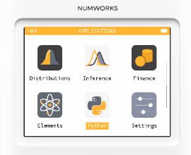
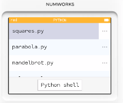
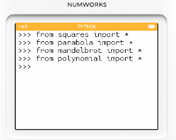
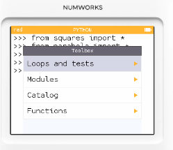
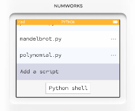
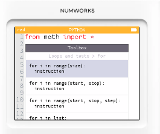
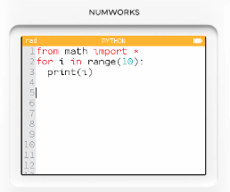
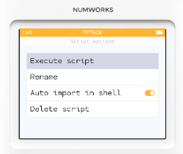
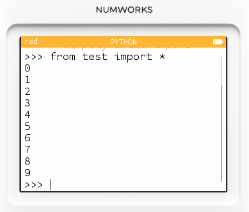

# Python 簡介: 內建編輯器與程式執行

## Python 環境簡介

Numworks 計算機可當作一台可隨身帶著跑的「MicroPython 小機器」，NumWorks 的 Python 就是給你在計算機上編寫、執行 Python 程式用的。

什麼是 NumWorks 的 Python？

* 基於 MicroPython 的精簡版 Python，重點在「學習、實驗、即時互動」。
* 直接在計算機的 Python App 裡編輯腳本、執行，或開 REPL 做即時測試。
* 檔案存在計算機內部（多個腳本），可用官方連線工具把程式跟電腦互傳。
* 沒有網路、沒有檔案系統 I/O（不能像電腦那樣自由讀寫硬碟檔案），記憶體也比電腦少，但執行反應很快、很適合教學與小專題。

* math 標準數學函數
* cmath 精簡版的複數函數
* matplotlib.pyplot 精簡版的 matplotlib
* numpy 精簡版的 numpy
* turtle 烏龜畫圖函數 
* random 隨機函數
* kandinsky Numworks 專屬的螢幕繪圖函數
* ion Numworks 專屬的鍵盤輸入函數
* time 時間函數

## 基礎使用方法

* 進入 **Python** 應用程式

* 選擇要編輯或執行的 python 程式

* 往下選，選擇 **Python shell**，可以開啟互動式開發環境。

* 你可以點選 **工具箱**，開啟快速輔助工具，可以讓您從選單選出需要輸入的函數。

* 我們將游標移到最下方，選擇 **Add a script**

* 進入編輯畫面後，按工具箱，選擇迴圈，選一個 For loop。

* 程式輸入完成

* 移到 **Execute script**，按下 exe 執行。

* 程式執行結果
