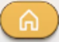
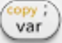

# 用戶手冊

Software version: 21 
軟體版本：21

按 打開和關閉設備。

當您第一次打開設備時，您可以選擇您的語言，然後再進入名為 **應用程序[Applications]** 的主選單。此螢幕顯示 NumWorks 計算器上可用的所有應用程序。您可以隨時按 返回主選單。

您可以使用方向鍵在主畫面上的應用程式之間移動。選擇您要使用的應用程序，然後按  將其開啟。

如果您想更改適用於所有應用程式的設置，請前往「設定 Settings」應用程式。您可以在此處選擇測量角度單位、語言等。

## 簡介 Introduction 

開始使用 NumWorks 圖形計算器。本章涵蓋了開始使用計算器所需了解的所有內容，從使用計算器鍵盤到切換主螢幕上的應用程式。

## 計算 Calculation 

執行各種計算，包含複數、矩陣、三角函數、排列組合、導數、積分和單位轉換。

## 繪圖器 Grapher 

繪製函數、曲線、圓錐曲線和不等式的圖表，查看點坐標，找到關鍵特徵，並查閱數值表。

## 方程式 Equations 

使用精確解和數值解求解方程式和方程組。

## 統計 Statistics 

研究數據集並查看與您的數據集相關的統計值：平均值、標準差、最小或最大值等。您還可以為您的數據集繪製箱型圖、直方圖和其他圖形。

## 迴歸 Regression 

建立散佈圖(scatterplot)並對二維資料集執行統計計算。繪製迴歸模型、進行預測並查看殘差值。

## 序列 Sequences 

繪製遞迴和明確定義的序列，檢視數值表格並計算每項的總和。

## 分佈 Distributions 

研究不同的機率分佈，例如二項式、幾何或常態分配。

## 統計推理 Inference 

執行假設檢定並建構平均值、比例等的信賴區間。

## 財務 Finance 

輕鬆解決涉及單利或複利的財務問題。

## 元素 Elements 

檢視互動式元素週期表。搜尋元素並檢視其特性。

## Python 程式語言工具 

編寫腳本並在互動式命令列中進行測試。 Python 是一種業界標準的程式語言，您可以在課堂上使用。(計算機上執行的是 MicroPython 環境)

## 變數 Variables 

變數儲存數字、矩陣、串列和函數，並更輕鬆地在計算和跨應用程式中使用它們。按  鍵以開啟儲存的數值清單。

## 工具箱 Toolbox 

 鍵可讓您存取有組織架構的進階函數庫：微積分、組合學、複數等。

## 設定 Settings 

變更適用於所有應用程式的設定。選擇角度測量單位、語言等。停用功能並重設計算器

有關符合國際標準、用戶必須採取的預防措施以及有關環境問題的信息，請參閱[合規性](https://www.numworks.com/manual/compliance/) 頁面。