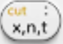

# 簡介 Introduction 

開始使用您的 NumWorks 圖形計算器！本章涵蓋了開始使用計算器所需了解的所有內容。

## 1. 一般用途 

### 1.1 電源開/關 

要開始使用 NumWorks 圖形計算器，您必須首次打開  按鍵。設備打開後，選擇您的國家和語言。如果需要，可以稍後更改。您的計算器現在將要求您下載最新版本的 NumWorks 軟件。

Updating your calculator It is important to update your NumWorks calculator before use. NumWorks releases free software updates often to provide you with the best tool possible. Begin the update process by connecting your calculator to a computer using the USB cable provided.
### 1.2 更新您的計算器

使用前更新 NumWorks 計算器非常重要。NumWorks 經常發布免費軟體更新，為您提供最好的工具。使用提供的 USB 連接線將計算機連接到電腦，開始更新過程。

若要更新您的計算機：

> 1. 建立或登入您的 NumWorks 帳戶 [my.numworks.com](https://my.numworks.com) 
> 2. 從您姓名下方的下拉式選單中選擇 **更新** ，然後選擇頁面上的 **更新** 按鈕。
> 3. 請按照螢幕上顯示的步驟進行操作。您的計算器現在是最新的！

## 2. 導航 NumWorks 計算器

### 2.1 主畫面 

您現在已到了 NumWorks 計算機的主畫面。這是您選擇要使用功能的中心。計算機的選單分為多個應用程式：計算、繪圖器、方程式、統計、迴歸、序列、機率分佈、統計推理、財務、化學元素週期表、Python 城市工具和設定。

若要在應用程式之間移動，請使用箭頭鍵。所選應用程式將以黃色突出顯示。突出顯示要使用的應用程式後，請使用  鍵進行確認。

您也可以使用數字鍵來快速導航應用程式。 鍵對應於計算機應用程式， 鍵對應於繪圖器應用程式等。按任意數字鍵兩次都會開啟對應的應用程式。

每個應用程式都有其獨特的功能和選項。例如，若要建立散佈圖，請使用迴歸應用程式。如果您目前使用的應用程式沒有您需要的功能，只需按  鍵即可。這將使您返回計算機的主畫面。

> 您也可以使用  鍵返回主畫面。只需繼續按該鍵，直到返回主畫面。

The NumWorks keyboard Navigation The navigation keys allow you to navigate through menus, return to the home screen and move between applications.
## 2.2 NumWorks 鍵盤

### 2.2.1 導覽 

導覽鍵可讓您瀏覽功能表、返回主畫面，以及在應用程式之間移動。

*     箭頭鍵用於在計算機螢幕上從一個項目移動到另一個項目。
*  可打開/關閉計算器。
*  無論您在計算器上的哪個位置，主頁鍵都會將您返回主畫面。
*  允許您在計算機上進行選擇。
*  允許您返回上一個畫面。
  
### 2.2.2 進階功能 

如果您有複雜的計算，無需擔心。進階功能按鈕將允許您計算更高級的功能。

*  允許您使用鍵上以黃色印刷的功能鍵（ALPHA、copy、asin 等）
*  允許您在表達式中輸入字母。
*  允許您輸入變量。輸入的變量會根據您輸入的表達式而變化。
*  當您按下 VAR 鍵時，您可以查看所有存儲的表達式、函數、列表、矩陣和序列。
*  對於每個應用程序都是唯一的。按工具箱鍵可查看進階功能選單。
*  允許您輸入指數。它的 shift 選項允許您存儲變量、表達式和函數以供以後使用。
* 
### 2.2.3 數字鍵 

您將最常使用的按鈕。在這裡您將找到數字鍵、運算鍵和 或 Enter 鍵。

* 按  確認您的輸入。
* 按下  時將輸入您最近的答案值。